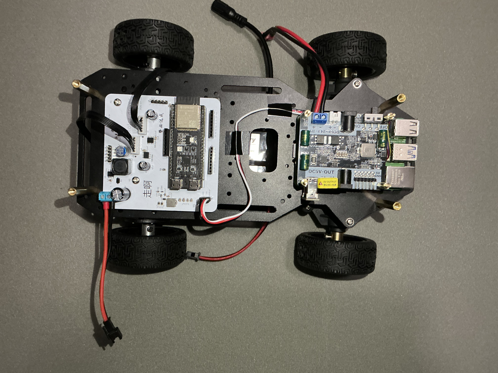
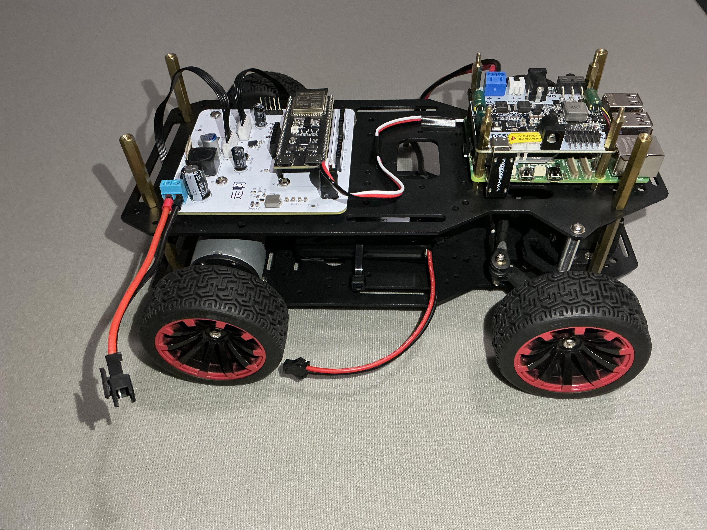

# WanHu
A mobile robot built around a Raspberry Pi 5 and an ESP32-S3.

Raspberry Pi 5 processes high-level inputs like user input or possible future vision input and sends control commands to ESP32-S3 over UDP.
ESP32-S3 receives commands and controls two DC-motors via H-bridge motor drivers and one servo motor. 

## System Architecture

## Actual images
### Top view

### Side View

## Project status
**The current system relies on controller input. Vision processing is not currently implemented.**

🟩 **First bring-up:** Stable control, two DC-motors and servo motor function as expected, maximum range tested was 10 meters, and communication-loss failsafe。 

🧪 **Ongoing testing focus:** additional reliability testing are in progress.

## Software
### Raspberry Pi5
Python
Pygame for controller input processing
Network hosting
UDP

### ESP32-S3
Arduino Framework 
Servo control
LEDC for DC-motor pwm control
Static IP for UDP

## ESP32-S3 motor driver:
This project uses the driver board [Visit GitHub](https://github.com/Luocheng945/ESP32-S3-motor-driver)
